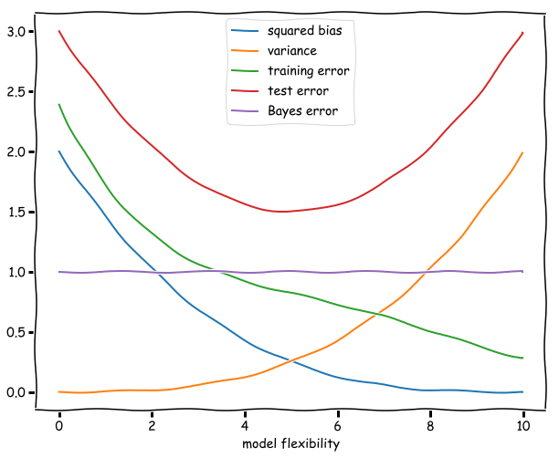

# Exercise 2.3

In (a) we provide a rough sketch of the general case, which is merely illustrative of the general behaviour of each quantity as described in (b). They are similar to the left panel of  figure 2.9 of the text and the left panel of figure 2.12. 

### (a) Sketch of bias, variance, training, test and Bayes errors


```python
# the functions chosen here were chosen just as a rough, quick way to sketch the functions in a plot
# they do not represent in any way a analytical formula for these quantities or anything of the sort
# these formulas would depend anyway on the model and fitting procedure in any case

import numpy as np
import matplotlib.pyplot as plt

x = np.arange(0.0, 10.0, 0.02)

def squared_bias(x):
    return .002*(-x+10)**3
def variance(x):
    return .002*x**3 
def training_error(x):
    return 2.38936 - 0.825077*x + 0.176655*x**2 - 0.0182319*x**3 + 0.00067091*x**4
def test_error(x):
    return 3 - 0.6*x + .06*x**2
def bayes_error(x):
    return x + 1 - x

plt.xkcd()
#frame = plt.gca()
#frame.axes.xaxis.set_ticklabels([])
plt.figure(figsize=(10, 8))
plt.plot(x,squared_bias(x), label='squared bias')
plt.plot(x, variance(x), label='variance')
plt.plot(x, training_error(x), label='training error')
plt.plot(x, test_error(x), label='test error')
plt.plot(x, bayes_error(x), label='Bayes error')
plt.legend(loc='upper center')
plt.xlabel('model flexibility')
plt.show()

#arbitrary units
```





### (b) Why these shapes?

**Squared bias.** This is the error in our model introduced by the difference of our approximation and the true underlying function. A more flexible model will be increasingly similar,  and the squared bias therefore dimishes as the flexibility increases. (It might even reach zero if for example the underlying function is a polynomial and by increasing the flexibility at a certain point we include the polynomials of this degree in our hypothesis space.)

**Variance.** In the limit of a model with no flexibility the variance will be zero, since the model fit will be independent of the data. As the flexibility increases the variance will increase as well since the noise in a particular training set will correspondingly captured by the model. The curve described by the variance is an monotonically increasing function of the flexibility of the model.

**Training error.** The training error is given by the average (squared) difference between the predictions of the model and the observations. If a model if very unflexible this can be quite high, but as the flexibility increases this difference will decrease. If we consider polynomials for example increasing the flexibility of the model might mean increasing the degree of the polynomial to be fitted. The additional degrees of freedom will decrease the average difference and reduce the training error.

**Test error.** Ths expected test error is given by the formula: Variance + Bias + Bayes error, all of which are non-negative. The Bayes error is constant and a lower bound for the test error. The test error has a minimum at an intermediate level of flexibility: not too flexible, so that the variance does not dominate, and not too unflexible, so that the squared bias is not too high. The plot of the test error thus resembles sort of an upward (deformed) parabola: high for unflexible models, decreasing as flexibility increases until it reaches a minimum. Then the variance starts to dominate and the test error starts increasing. The distance between this minimum and the Bayes irreducible error gives us an idea of how well the best function in the hypothesis space will fit.

**Bayes error.** This term is constant since by definition it does not depend on X and therefore on the flexibility of the model.
